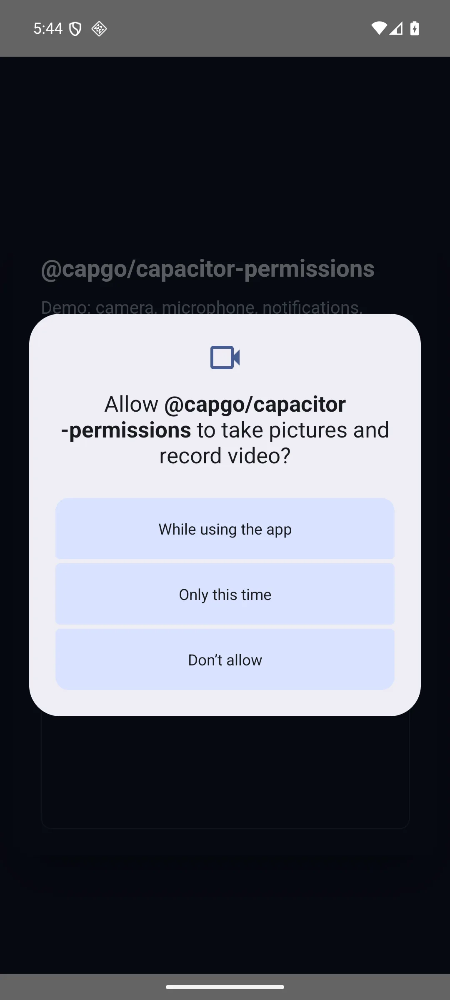
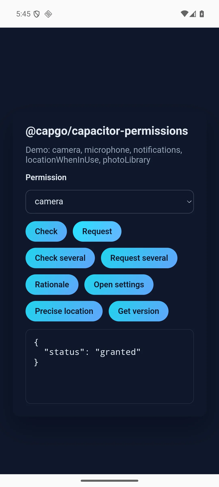

# @capgo/capacitor-permissions

<a href="https://capgo.app/"></a>

<div align="center">
  <h2><a href="https://capgo.app/?ref=plugin_permissions"> ➡️ Get Instant updates for your App with Capgo</a></h2>
  <h2><a href="https://capgo.app/consulting/?ref=plugin_permissions"> Missing a feature? We’ll build the plugin for you 💪</a></h2>
</div>

<p align="center">
  
  
</p>

## Snapshot

- **Plugin name:** `Permissions`
- **One-line value:** `Check and request common permissions with one API and shared status values.`
- **Maintainer:** `Capgo`
- **Status:** `alpha`

## Pre-Release Checklist

- [x] Placeholder values in this README are filled in.
- [x] Capgo CTA links use this plugin's ref slug.
- [x] README banner points at this repository.
- [x] `package.json` keywords are filled in.
- [x] Git remote points at this repository.
- [x] Bootstrap init script and templates are removed.
- [x] Compatibility table starts at Capacitor 8.
- [x] Update `src/definitions.ts` with the real public API and JSDoc.
- [x] Run `bun run docgen` and review generated API docs below.
- [x] Confirm examples in this file run against the real implementation.
- [ ] Set GitHub repo description to start with `Capacitor plugin for ...`.
- [x] GitHub homepage is `https://capgo.app/docs/plugins/permissions/`.
- [ ] Create a GitHub repository custom social preview from `assets/github-social-template.svg`, export it to `assets/github-social-preview.png`, and upload it at GitHub **Settings** -> **General** -> **Social preview**.
- [ ] Open docs/website PR and follow the complete website integration checklist in section **3) Open docs/website pull request**.
- [ ] Run `bun run verify` before publishing.

## Problem & Scope

### Why this plugin exists

`Each Capacitor plugin asks for permissions differently. Apps need one status model, batch checks, and a way to declare only the permissions they use.`

## Capgo Links

- **Plugin docs URL:** `https://capgo.app/docs/plugins/permissions/`
- **Plugin tutorial URL:** `https://capgo.app/docs/plugins/permissions/`
- **Website/docs repo:** `https://github.com/Cap-go/website`

### What it does

- `Checks or requests one permission or several at once. Every platform reports the same statuses: granted, denied, blocked, limited, unavailable.`
- `Reports when Android should show a rationale, opens app or notification settings, and can ask again for precise location on iOS.`
- `Keeps native declarations opt-in. Apps add only the Info.plist and AndroidManifest entries they use.`

### What it does not do

- `Does not grant permissions the operating system has blocked. The user still has to allow them.`
- `Does not declare unused permissions inside the plugin manifest.`

## Compatibility

| Plugin version | Capacitor compatibility | Maintained |
| -------------- | ----------------------- | ---------- |
| v8.\*.\*       | v8.\*.\*                | ✅          |
| v7.\*.\*       | v7.\*.\*                | On demand   |
| v6.\*.\*       | v6.\*.\*                | On demand   |

Policy:

- New plugins start at version `8.0.0` (Capacitor 8 baseline).
- Backward compatibility for older Capacitor majors is supported on demand.

## Development

```bash
bun install
bun run verify
```


## Capgo Example App Deploy Setup

The `Deploy example app to Capgo` GitHub Actions workflow publishes the built `example-app/` web bundle to Capgo when a GitHub release is published or the workflow is manually dispatched. It checks out the release tag, builds the plugin and example app with Bun, and uploads the bundle with one direct Capgo CLI command.

Required setup for every plugin created from this template:

1. Create a Capgo app for the example app id from `example-app/capacitor.config.ts`.
   The default id is `app.capgo.permissions.example`; after `bun run init-plugin ...`, verify both `appId` values in that file match the new plugin package id plus `.example`.
2. Keep the Capgo channel named `production`, or edit `.github/workflows/deploy_example_app.yml` if the example app should publish to a different default channel.

`CAPGO_TOKEN` is already configured as a Capgo organization GitHub Actions secret and is read by the workflow through `${{ secrets.CAPGO_TOKEN }}`. Do not create a duplicate repository secret for new plugin repositories.

## Capacitor Hook Scripts (Recommended)

For plugins that need automated setup during `cap sync` / `cap update`, define Capacitor lifecycle hooks in `package.json`.

Example:

```json
{
  "scripts": {
    "generate:version-share": "bun run scripts/generate-version-share-data.mjs",
    "configure:dependencies": "bun run scripts/configure-dependencies.mjs",
    "capacitor:sync:before": "bun run generate:version-share",
    "capacitor:update:before": "bun run generate:version-share",
    "capacitor:sync:after": "bun run configure:dependencies"
  }
}
```

Guideline:
- Use `*:before` for generated inputs needed by native sync/update.
- Use `*:after` for native patching that depends on files created by sync/update.
- Keep hook scripts idempotent.

## Public Launch (Required)

### 1) Publish in Capgo GitHub org as public

```bash
gh repo create Cap-go/capacitor-permissions --public --source=. --remote=origin --push
```

If the repo already exists and is private:

```bash
gh repo edit Cap-go/capacitor-permissions --visibility public --accept-visibility-change-consequences
```

### 2) Set GitHub description, homepage, and custom social preview

Description must always start with: `Capacitor plugin for ...`

```bash
gh repo edit Cap-go/capacitor-permissions \
  --description "Capacitor plugin for checking and requesting app permissions." \
  --homepage "https://capgo.app/docs/plugins/permissions/"
```

Create the GitHub repository custom social preview before launch. GitHub uses this image for repository cards, link unfurls, and social shares; it is separate from the README banner and website docs images.

1. Open `assets/github-social-template.svg`.
2. Replace the sample headline, accent line, description, and badges with plugin-specific copy.
3. Keep the terminal command as `npm i @capgo/capacitor-permissions` because social and docs copy should use public npm install syntax.
4. Export the SVG as a 1280 x 640 PNG at `assets/github-social-preview.png`.
5. Have the agent try to upload the PNG in GitHub under repository **Settings** -> **General** -> **Social preview** -> **Edit**.
6. Prefer a supported GitHub API if one exists. GitHub currently does not expose a supported public REST/GraphQL endpoint for this upload, so the practical automation path is an authenticated browser session with repository admin access.
7. If the agent cannot access an authenticated GitHub web session with admin rights, keep `assets/github-social-preview.png` in the repo and report that only the GitHub UI upload is blocked.
8. Do not treat the repository as launch-ready until this custom GitHub social preview is uploaded.
9. Copy targets: headline 4-9 words, accent line 2-6 words, description 60-110 characters, badges 1-3 words each. These are guardrails, not hard failures; the SVG clips longer text inside safe regions, so only shorten copy when the rendered image is hard to read or visibly clipped.

### 3) Open docs/website pull request

Create a PR on `https://github.com/Cap-go/website` (or the local `landing/` folder in the monorepo) with all of the following:

1. Add the plugin entry in `src/config/plugins.ts`.
2. Add a plugin `LinkCard` in `src/content/docs/docs/plugins/index.mdx`.
3. Create docs pages in `src/content/docs/docs/plugins/<plugin-doc-slug>/`:
   `index.mdx`, `getting-started.mdx`, and optionally `ios.mdx` + `android.mdx` when platform setup differs.
4. Update `astro.config.mjs`:
   add `docs/plugins/<plugin-doc-slug>/**` in pagefind path buckets and add a sidebar section for the plugin pages.
5. Add the SEO tutorial page in `src/content/plugins-tutorials/en/<plugin-repo-slug>.md`.
6. Add icon asset `public/icons/plugins/<plugin-doc-slug>.svg` if the docs hero uses a plugin icon.
7. Cross-link docs and tutorial pages.

Slug mapping rules:

- `<plugin-doc-slug>` is the docs route slug used under `/docs/plugins/<plugin-doc-slug>/`.
- `<plugin-repo-slug>` is extracted from the GitHub repo URL in `src/config/plugins.ts` and is used by `/plugins/<slug>/`.
- Example: repo `https://github.com/Cap-go/capacitor-app-attest/` requires tutorial file
  `src/content/plugins-tutorials/en/capacitor-app-attest.md`.

Starter snippets:

`src/config/plugins.ts`

```ts
{
  name: '@capgo/capacitor-permissions',
  author: 'github.com/Cap-go',
  description: 'Capacitor plugin for checking and requesting app permissions',
  href: 'https://github.com/Cap-go/capacitor-permissions/',
  title: 'Permissions',
  icon: ShieldCheckIcon,
},
```

`astro.config.mjs` sidebar entry

```ts
{
  label: 'Permissions',
  items: [
    { label: 'Overview', link: '/docs/plugins/<plugin-doc-slug>/' },
    { label: 'Getting started', link: '/docs/plugins/<plugin-doc-slug>/getting-started' },
    { label: 'iOS setup', link: '/docs/plugins/<plugin-doc-slug>/ios' },
    { label: 'Android setup', link: '/docs/plugins/<plugin-doc-slug>/android' },
  ],
  collapsed: true,
},
```

Required docs files:

- `src/content/docs/docs/plugins/<plugin-doc-slug>/index.mdx`
- `src/content/docs/docs/plugins/<plugin-doc-slug>/getting-started.mdx`
- `src/content/docs/docs/plugins/<plugin-doc-slug>/ios.mdx` (if iOS-specific setup exists)
- `src/content/docs/docs/plugins/<plugin-doc-slug>/android.mdx` (if Android-specific setup exists)
- `src/content/plugins-tutorials/en/<plugin-repo-slug>.md`

## Install

You can use our AI-Assisted Setup to install the plugin. Add the Capgo skills to your AI tool using the following command:

```bash
npx skills add https://github.com/cap-go/capacitor-skills --skill capacitor-plugins
```

Then use the following prompt:

```text
Use the `capacitor-plugins` skill from `cap-go/capacitor-skills` to install the `@capgo/capacitor-permissions` plugin in my project.
```

If you prefer Manual Setup, install the plugin by running the following commands and follow the platform-specific instructions below:

```bash
bun add @capgo/capacitor-permissions
bunx cap sync
```

## Minimal Usage

```typescript
import { Permissions } from '@capgo/capacitor-permissions';

const { status } = await Permissions.check({ permission: 'camera' });
if (status !== 'granted') {
  const requested = await Permissions.request({ permission: 'camera' });
  console.log(requested.status);
}
```

## Opt-in native declarations

The plugin Android library manifest declares **no** `uses-permission` entries, and iOS usage strings are not forced into every app. Add only what you use:

```bash
node scripts/apply-permissions.mjs --project ./example-app --permissions camera,microphone,notifications,locationWhenInUse,photoLibrary
```

Pass your Capacitor app directory to `--project`. The script updates `android/app/src/main/AndroidManifest.xml` and `ios/App/App/Info.plist` when those files exist. It is idempotent.

## Integration Notes

- **iOS:** `Maps system authorization states, including limited photo access and reduced location accuracy, onto the shared statuses. Usage strings stay in the app.`
- **Android:** `Uses runtime permission APIs. The plugin library manifest declares no permissions, so review only sees what the app opts into.`
- **Web:** `Uses the browser Permissions API where one exists. Other permissions report unavailable.`

## Example App

The `example-app/` folder demos `camera`, `microphone`, `notifications`, `locationWhenInUse`, and `photoLibrary`. Apply declarations with the command above, then run `bun run start` inside `example-app/`.

<p align="center">
  
  
</p>

## API

<docgen-index>

* [`check(...)`](#check)
* [`request(...)`](#request)
* [`checkMultiple(...)`](#checkmultiple)
* [`requestMultiple(...)`](#requestmultiple)
* [`shouldShowRationale(...)`](#shouldshowrationale)
* [`openSettings(...)`](#opensettings)
* [`requestPreciseLocation()`](#requestpreciselocation)
* [`getPluginVersion()`](#getpluginversion)
* [Interfaces](#interfaces)
* [Type Aliases](#type-aliases)

</docgen-index>

<docgen-api>
<!--Update the source file JSDoc comments and rerun docgen to update the docs below-->

Cross-platform permissions API for Capacitor apps.

### check(...)

```typescript
check(options: PermissionOptions) => Promise<PermissionStatusResult>
```

Check the current status of one permission without prompting the user.

| Param         | Type                                                            |
| ------------- | --------------------------------------------------------------- |
| **`options`** | <code><a href="#permissionoptions">PermissionOptions</a></code> |

**Returns:** <code>Promise&lt;<a href="#permissionstatusresult">PermissionStatusResult</a>&gt;</code>

--------------------


### request(...)

```typescript
request(options: PermissionOptions) => Promise<PermissionStatusResult>
```

Request one permission from the user. On Android, shows the system dialog when needed.

| Param         | Type                                                            |
| ------------- | --------------------------------------------------------------- |
| **`options`** | <code><a href="#permissionoptions">PermissionOptions</a></code> |

**Returns:** <code>Promise&lt;<a href="#permissionstatusresult">PermissionStatusResult</a>&gt;</code>

--------------------


### checkMultiple(...)

```typescript
checkMultiple(options: MultiplePermissionOptions) => Promise<MultiplePermissionStatusResult>
```

Check several permissions without prompting.

| Param         | Type                                                                            |
| ------------- | ------------------------------------------------------------------------------- |
| **`options`** | <code><a href="#multiplepermissionoptions">MultiplePermissionOptions</a></code> |

**Returns:** <code>Promise&lt;<a href="#multiplepermissionstatusresult">MultiplePermissionStatusResult</a>&gt;</code>

--------------------


### requestMultiple(...)

```typescript
requestMultiple(options: MultiplePermissionOptions) => Promise<MultiplePermissionStatusResult>
```

Request several permissions sequentially so dialogs are not shown on top of each other.

| Param         | Type                                                                            |
| ------------- | ------------------------------------------------------------------------------- |
| **`options`** | <code><a href="#multiplepermissionoptions">MultiplePermissionOptions</a></code> |

**Returns:** <code>Promise&lt;<a href="#multiplepermissionstatusresult">MultiplePermissionStatusResult</a>&gt;</code>

--------------------


### shouldShowRationale(...)

```typescript
shouldShowRationale(options: PermissionOptions) => Promise<ShouldShowRationaleResult>
```

Whether Android should show a rationale before requesting again.
Returns `{ shouldShow: false }` on iOS and web.

| Param         | Type                                                            |
| ------------- | --------------------------------------------------------------- |
| **`options`** | <code><a href="#permissionoptions">PermissionOptions</a></code> |

**Returns:** <code>Promise&lt;<a href="#shouldshowrationaleresult">ShouldShowRationaleResult</a>&gt;</code>

--------------------


### openSettings(...)

```typescript
openSettings(options?: OpenSettingsOptions | undefined) => Promise<void>
```

Open the application or notification settings screen.
Rejects on web with `UNIMPLEMENTED`.

| Param         | Type                                                                |
| ------------- | ------------------------------------------------------------------- |
| **`options`** | <code><a href="#opensettingsoptions">OpenSettingsOptions</a></code> |

--------------------


### requestPreciseLocation()

```typescript
requestPreciseLocation() => Promise<PermissionStatusResult>
```

Ask for precise location.
On iOS, requests temporary full accuracy when already authorized when-in-use.
On Android, requests `ACCESS_FINE_LOCATION`.
On web, returns the geolocation permission status after prompting when possible.

**Returns:** <code>Promise&lt;<a href="#permissionstatusresult">PermissionStatusResult</a>&gt;</code>

--------------------


### getPluginVersion()

```typescript
getPluginVersion() => Promise<PluginVersionResult>
```

Returns the platform implementation version marker.

**Returns:** <code>Promise&lt;<a href="#pluginversionresult">PluginVersionResult</a>&gt;</code>

--------------------


### Interfaces


#### PermissionStatusResult

Result for a single permission status.

| Prop         | Type                                                              | Description                                  |
| ------------ | ----------------------------------------------------------------- | -------------------------------------------- |
| **`status`** | <code><a href="#apppermissionstate">AppPermissionState</a></code> | Current status for the requested permission. |


#### PermissionOptions

Options for checking or requesting a single permission.

| Prop             | Type                                                      | Description             |
| ---------------- | --------------------------------------------------------- | ----------------------- |
| **`permission`** | <code><a href="#permissionname">PermissionName</a></code> | Permission to evaluate. |


#### MultiplePermissionStatusResult

Result for several permission statuses.

| Prop           | Type                                                                                                          | Description                       |
| -------------- | ------------------------------------------------------------------------------------------------------------- | --------------------------------- |
| **`statuses`** | <code><a href="#record">Record</a>&lt;string, <a href="#apppermissionstate">AppPermissionState</a>&gt;</code> | Map of permission name to status. |


#### MultiplePermissionOptions

Options for checking or requesting several permissions.

| Prop              | Type                          | Description                       |
| ----------------- | ----------------------------- | --------------------------------- |
| **`permissions`** | <code>PermissionName[]</code> | Permissions to evaluate in order. |


#### ShouldShowRationaleResult

Result for Android rationale checks.

| Prop             | Type                 | Description                                                                                                |
| ---------------- | -------------------- | ---------------------------------------------------------------------------------------------------------- |
| **`shouldShow`** | <code>boolean</code> | True only when Android would show a rationale dialog before requesting again. Always false on iOS and web. |


#### OpenSettingsOptions

Options for opening system settings.

| Prop       | Type                                                  | Description                                               |
| ---------- | ----------------------------------------------------- | --------------------------------------------------------- |
| **`type`** | <code><a href="#settingstype">SettingsType</a></code> | Which settings screen to open. Defaults to `application`. |


#### PluginVersionResult

Plugin version payload.

| Prop          | Type                | Description                                                                                         |
| ------------- | ------------------- | --------------------------------------------------------------------------------------------------- |
| **`version`** | <code>string</code> | Version identifier returned by the platform implementation (`native` on mobile, `web` in browsers). |


### Type Aliases


#### AppPermissionState

Normalized permission status returned by every platform implementation.

- `granted`: the user allowed full access.
- `denied`: the user has not granted access yet, or Android can show a rationale.
- `blocked`: the user denied access and the app cannot prompt again without settings.
- `limited`: partial access (for example iOS limited photo library or reduced location accuracy).
- `unavailable`: the permission is not supported on this platform or not declared in the app manifest.

<code>'granted' | 'denied' | 'blocked' | 'limited' | 'unavailable'</code>


#### PermissionName

Logical permission identifiers shared across iOS, Android, and web.

Android-only names include `activityRecognition`, `phone`, `sms`, `mediaAudio`, `mediaImages`, and `mediaVideo`.
iOS-only names include `reminders` and `appTrackingTransparency`.
Web supports a subset via browser APIs (`camera`, `microphone`, `notifications`, `locationWhenInUse`, `locationAlways`).

<code>'camera' | 'microphone' | 'photoLibrary' | 'photoLibraryAddOnly' | 'contacts' | 'calendar' | 'reminders' | 'locationWhenInUse' | 'locationAlways' | 'bluetooth' | 'motion' | 'notifications' | 'speechRecognition' | 'appTrackingTransparency' | 'activityRecognition' | 'phone' | 'sms' | 'mediaAudio' | 'mediaImages' | 'mediaVideo'</code>


#### Record

Construct a type with a set of properties K of type T

<code>{
 [P in K]: T;
 }</code>


#### SettingsType

Settings screen type for `openSettings`.

<code>'application' | 'notifications'</code>

</docgen-api>
